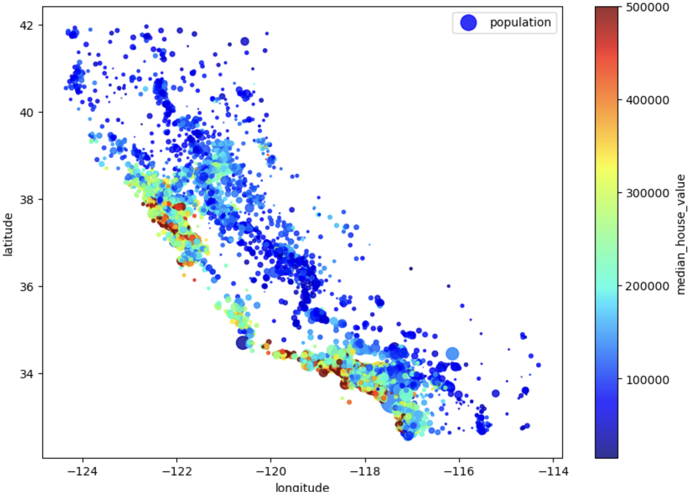

# California housing 🏡

Data from California Housing Corporation, model implementation with the most common algorithms.
Given various metrics like population, median income, median housing prices per block groups (districts).
Data refers to US census